<div align="center">

# ⚡ Voltify

### IoT Energy Analytics &amp; Budget Auditing Platform

A real-time, event-driven platform that streams household appliance telemetry, computes live **kWh &amp; TL billing**, enforces **dynamic penalty tariffs**, detects **device anomalies**, and dispatches **AI-generated Turkish advisories** by email — all rendered in a live React dashboard with a gamified Eco-Pet mascot.

[](http://34.179.235.4)
[](https://github.com/iamhilals/i2i-Academy-Voltify-18)


</div>

---

## 📸 Preview

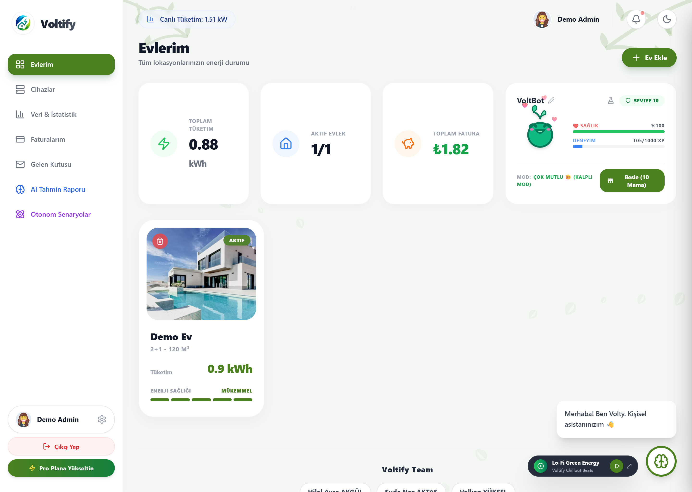

> The dashboard grid: every home with live consumption, aggregate billing, and the gamified **Eco-Pet (VoltBot)**.

---

## 📑 Table of Contents

- [What is Voltify?](#-what-is-voltify)
- [Quick Start](#-quick-start-3-steps)
- [System Architecture](#-system-architecture)
- [Where Data Lives](#-where-data-lives-storage-model)
- [Database Schema (ER Diagram)](#-database-schema-er-diagram)
- [Telemetry Data Flow](#-telemetry-data-flow)
- [Billing &amp; Penalty Engine](#-billing--penalty-engine)
- [Anomaly Detection](#-anomaly-detection)
- [AI Advisory &amp; Email Pipeline](#-ai-advisory--email-pipeline)
- [Application Walkthrough](#-application-walkthrough)
- [REST API Reference](#-rest-api-reference)
- [Security](#-security)
- [Tech Stack &amp; Design Rationale](#-tech-stack--design-rationale)
- [Project Structure](#-project-structure)
- [Team](#-team)

---

## 🎯 What is Voltify?

Voltify (a.k.a. **VoltWise**) simulates smart-home appliances that emit a power reading every **2 seconds**. Readings flow through **Apache Kafka** into a modular **Spring Boot** core that converts watts to kWh, accrues a running TL bill, evaluates **80% / 100%** quota thresholds, flips homes into a **penalty tariff** once the budget is breached, and flags appliances that exceed their safe limit for **3 consecutive cycles**. Every breach triggers a **Google Gemini** advisory that is emailed to the household and archived. A **React** SPA renders everything live, with sub-second polling served from an in-memory **Apache Ignite** tier.

| ⏱️ Telemetry | 🧩 Components | 🗄️ SQL Tables | ⚡ Ignite Caches |
|:---:|:---:|:---:|:---:|
| every **2 s** | **7** | **8** | **5** |

> [!NOTE]
> **Voltify does not use Redis.** Its fast, in-memory tier is **Apache Ignite (IMDG)**, which fills the role Redis would otherwise play — live counters, ephemeral state, and sub-millisecond reads.

---

## 🚀 Quick Start (3 Steps)

> **Prerequisites:** Docker Desktop · JDK 17+ · Node.js 18+

### 1️⃣ Start infrastructure (PostgreSQL + Kafka + Zookeeper + Ignite)

```bash
docker-compose up -d
```

Provisions **PostgreSQL** (`5434`), **Kafka** (`9092`), **Zookeeper**, and **Ignite** (`10800`), and auto-runs `schema.sql` to create all tables.

### 2️⃣ Run the backend (Spring Boot — `voltify-core`)

```bash
cd voltify-core
./mvnw spring-boot:run
```

Backend → **http://localhost:8080** · Swagger UI → **http://localhost:8080/swagger-ui.html**

### 3️⃣ Run the frontend (React — `voltify-web`)

```bash
cd voltify-web
npm install
npm start
```

Dashboard → **http://localhost:3000**

> 💡 **One-click demo login:** the backend seeds a demo account on startup — **username `admin`, password `admin123`** — with a sample home and appliances. Just click *"Admin Login"* on the login screen.

---

## 🏛 System Architecture

Voltify is a **modular Spring Boot monolith** backed by three storage tiers, each with a clearly separated responsibility. Telemetry is written to Ignite **first**, then persisted to PostgreSQL, so a slow database never blocks a live UI read. Kafka decouples the simulator from the billing engine.

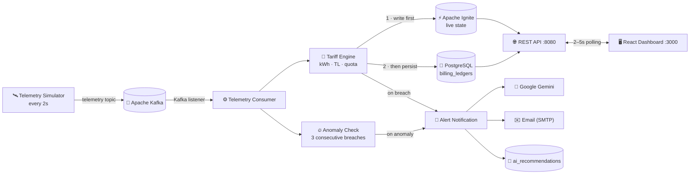

| Concern | Served from | Why |
| :--- | :--- | :--- |
| Live home / appliance metrics | **Apache Ignite** | Sub-millisecond reads shield the DB from high-frequency polling |
| Registries, ledgers, history, logs | **PostgreSQL** | ACID single source of truth, durable across restarts |
| Telemetry &amp; asset registration | **Apache Kafka** | Loose coupling between simulator and core |

---

## 🗄 Where Data Lives (Storage Model)

Three tiers, three clearly separated responsibilities.

### 🐘 PostgreSQL — durable, ACID (port `5434`)
Master registries, financial ledgers, audit trails, and permanent AI recommendations. Eight tables, all with `ON DELETE CASCADE`. DDL runs automatically on first container boot.

`users` · `homes` · `appliances` · `billing_ledgers` · `consumption_snapshots` · `event_logs` · `ai_recommendations` · `eco_pets`

### ⚡ Apache Ignite — ephemeral, in-memory (port `10800`)
Sub-millisecond live state and counters. Reset on restart **by design** — a startup task also zeroes the SQL ledger so the dashboard begins consistent.

`homeLiveState` · `applianceBreachCounter` · `applianceLiveWatt` · `applianceHistory` · `applianceCumulativeWatt`

### 📨 Apache Kafka — event stream (port `9092`)
`telemetry` · `asset-registration`

> [!IMPORTANT]
> Because Ignite is in-memory, [`LedgerResetOnStartup`](voltify-core/src/main/java/com/voltify/core/service/LedgerResetOnStartup.java) zeroes every `billing_ledger` on boot so live dashboards start consistent and quota/penalty logic can re-trigger cleanly. Durable daily history is never lost — it lives in `consumption_snapshots`.

---

## 🧬 Database Schema (ER Diagram)

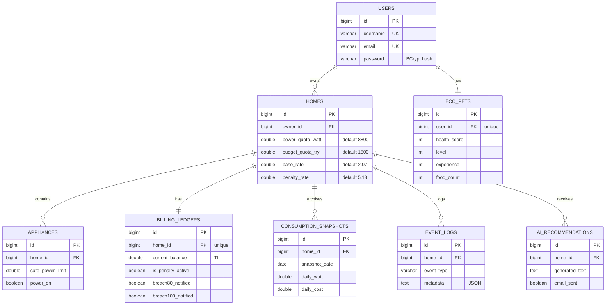

---

## 🔄 Telemetry Data Flow

One packet through the system. **Order matters:** the consumer writes live state to Ignite **before** persisting the ledger to PostgreSQL.

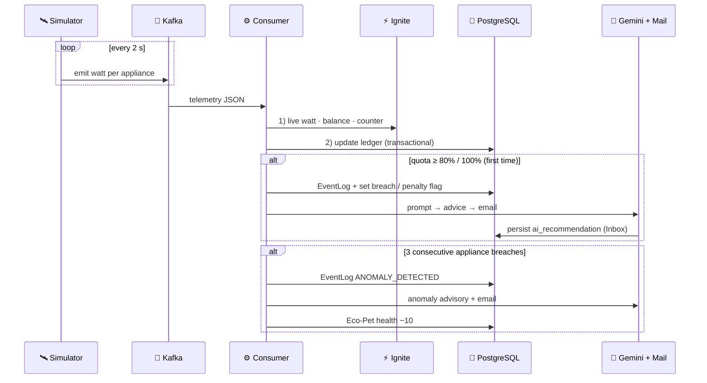

---

## 💰 Billing &amp; Penalty Engine

The heart of the system is [`TariffEngineService`](voltify-core/src/main/java/com/voltify/core/service/TariffEngineService.java), which runs on every telemetry packet.

### Physical energy formula (SI)

Telemetry arrives every **Δt = 2.0 s**, so a single constant converts watts to energy:

```
kWh = (Watt / 1000) × (2.0 / 3600) = Watt / 1,800,000
```

### Normal vs. penalty billing

```java
double addedKwh  = watt / 1_800_000.0;
double rate      = isPenaltyActive ? penaltyRate : baseRate; // 5.18 vs 2.07 TL/kWh
double addedCost = addedKwh * rate;
currentBalance  += addedCost;
```

### Quota evaluation &amp; penalty lifecycle

Two independent ratios are computed; the **larger** decides breaches. The power ratio uses the **instantaneous** total draw — not cumulative watts — so the limit reflects real overload rather than tripping within seconds.

```java
wattRatio   = instantTotalWatt / powerQuotaWatt;  // instantaneous
budgetRatio = currentBalance   / budgetQuotaTry;  // accumulated TL
maxRatio    = max(wattRatio, budgetRatio);
```

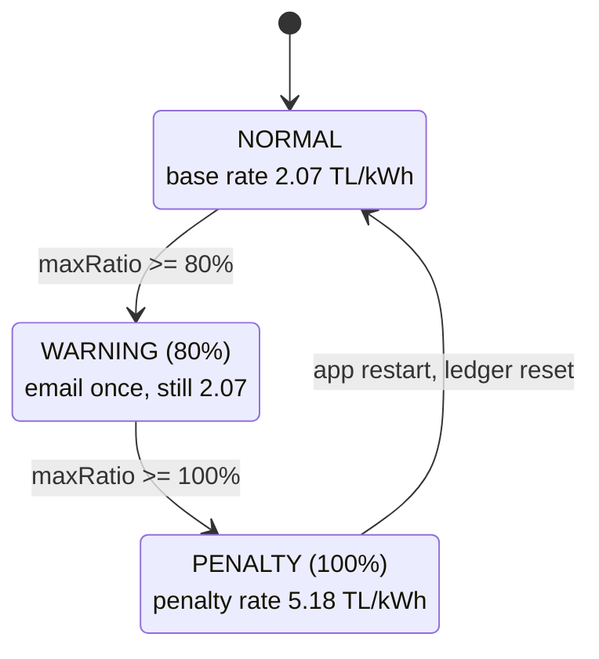

> [!TIP]
> The `breach80_notified` / `breach100_notified` flags in `billing_ledgers` guarantee each threshold notifies the user **exactly once**, preventing duplicate emails. Once penalty activates, **all subsequent** usage bills at the premium rate (~2.5× base) — there is no retroactive recompute.

The engine, visualised live in the home detail view:

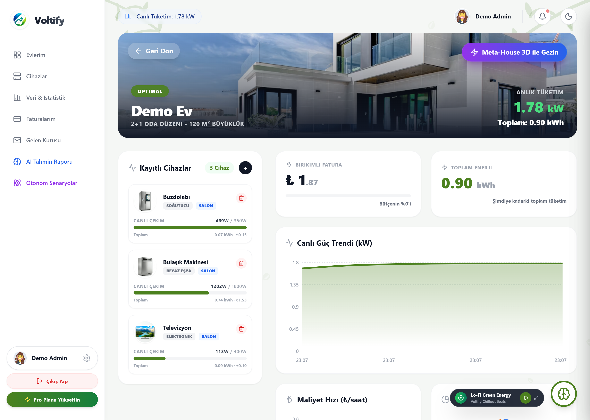

> Per-appliance live draw vs. safe limit (left), accumulated bill and total energy (right), and a **live power-trend chart** — all updated every 2 s from Ignite.

---

## 🔥 Anomaly Detection

Independent of billing, each appliance carries a consecutive-breach counter in Ignite. Exceed the safe limit for **3 cycles in a row** and the device is flagged anomalous — an event is logged, an AI email is sent, and the owner's Eco-Pet loses 10 health. Returning to normal resets the counter and logs a resolution, so alerts never spam. See [`TelemetryConsumerService`](voltify-core/src/main/java/com/voltify/core/telemetry/TelemetryConsumerService.java).

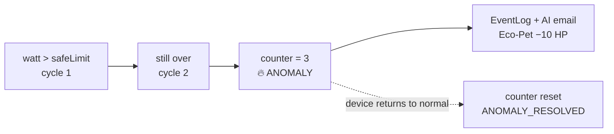

---

## 🤖 AI Advisory &amp; Email Pipeline

On any breach or anomaly, the core assembles home, appliance, and billing context into a strict prompt, sends it to **Google Gemini**, persists the reply to `ai_recommendations` (the in-app Inbox), and emails it as rendered HTML. Gemini may only reference appliances actually registered to that home. If the API key is missing or the call fails, a clean fallback text is returned — the server and Kafka consumers **never block**. See [`GeminiService`](voltify-core/src/main/java/com/voltify/core/service/GeminiService.java) and [`AlertNotificationService`](voltify-core/src/main/java/com/voltify/core/service/AlertNotificationService.java).

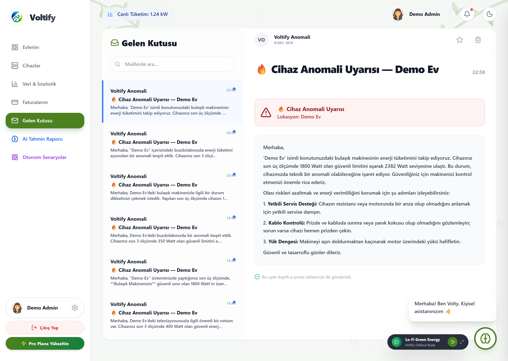

> Real Gemini-generated anomaly advisories, each also delivered to the household's contact email.

---

## 🖥 Application Walkthrough

<table>
<tr>
<td width="50%">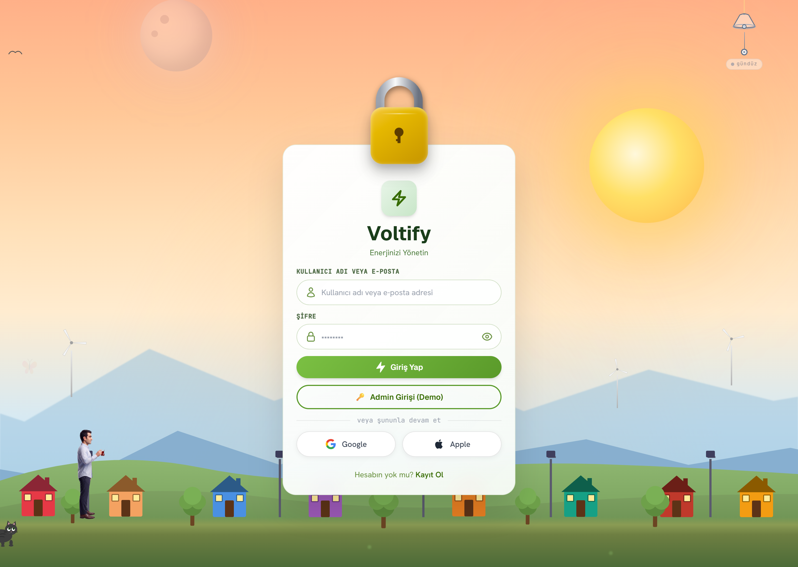<br/><sub><b>Authentication</b> — JWT login by username <i>or</i> email, plus one-click demo entry. Passwords BCrypt-hashed.</sub></td>
<td width="50%">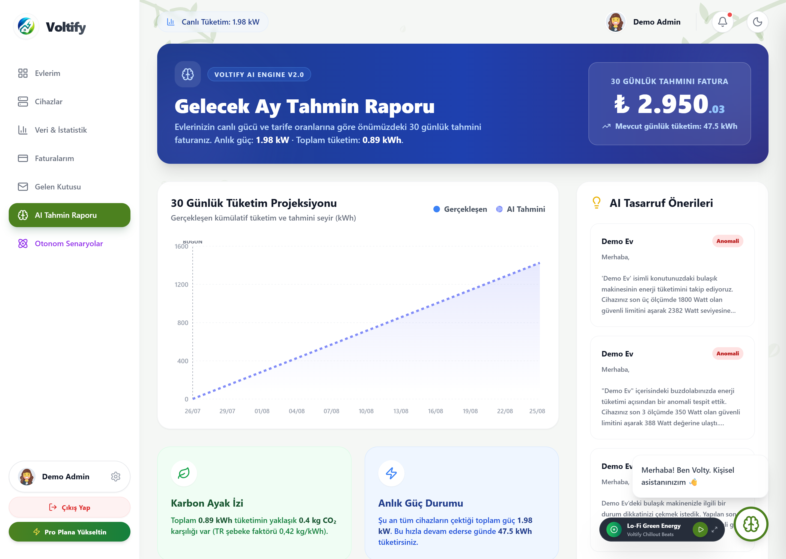<br/><sub><b>AI Prediction Report</b> — 30-day cost projection, carbon footprint, and Gemini savings tips.</sub></td>
</tr>
<tr>
<td width="50%">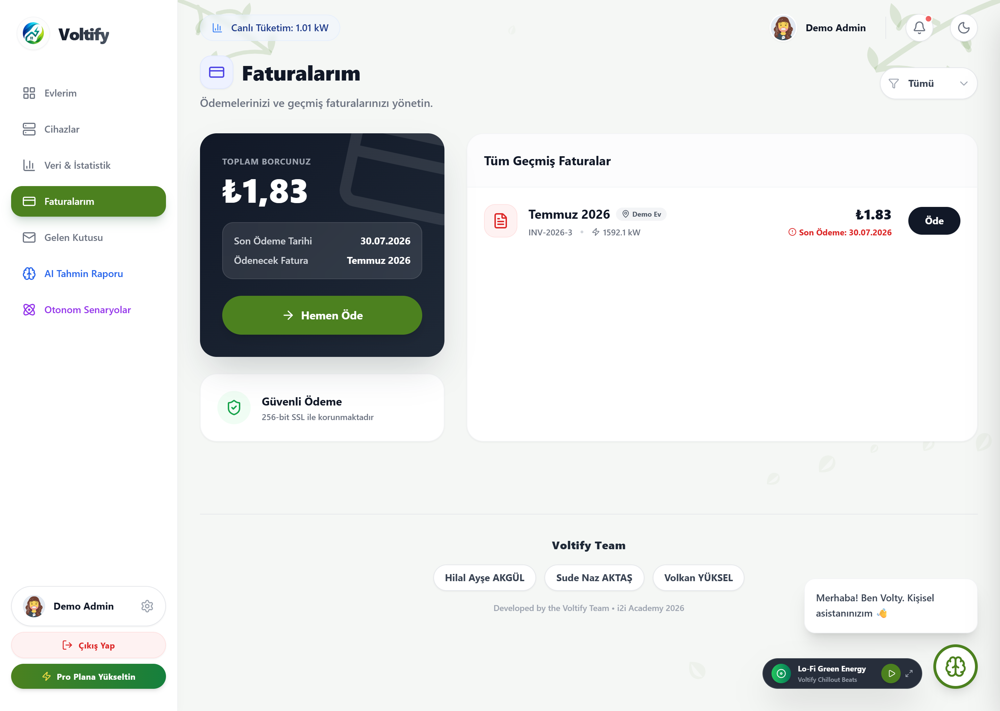<br/><sub><b>Billing</b> — outstanding balance, due date, and per-home invoice history from PostgreSQL.</sub></td>
<td width="50%">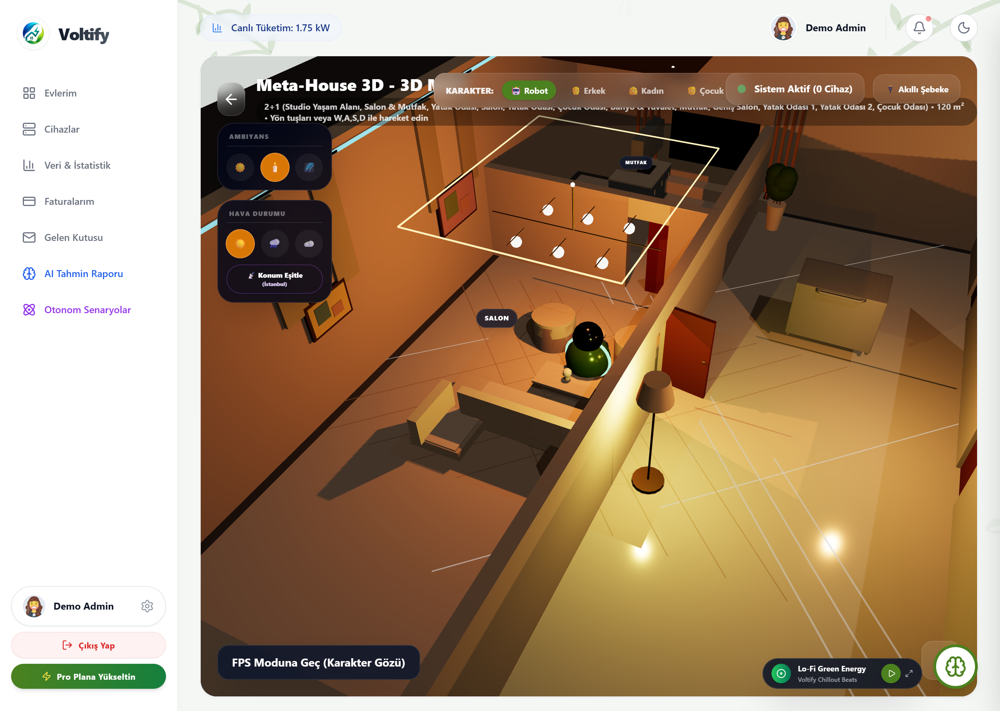<br/><sub><b>Meta-House 3D</b> — a walkable Three.js twin of the home with room layout and ambience.</sub></td>
</tr>
<tr>
<td width="50%">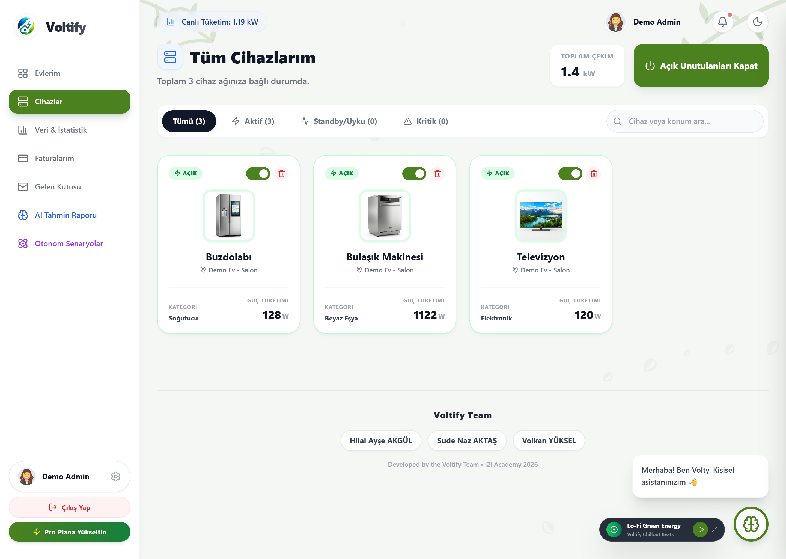<br/><sub><b>Devices</b> — manage appliances, safe limits, and real on/off power control.</sub></td>
<td width="50%">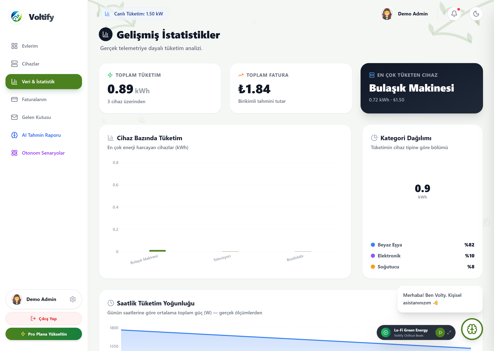<br/><sub><b>Statistics</b> — consumption analytics and historical trends.</sub></td>
</tr>
</table>

---

## 🌐 REST API Reference

Full interactive docs (with a **Bearer JWT** authorize button) live at **`/swagger-ui.html`**.

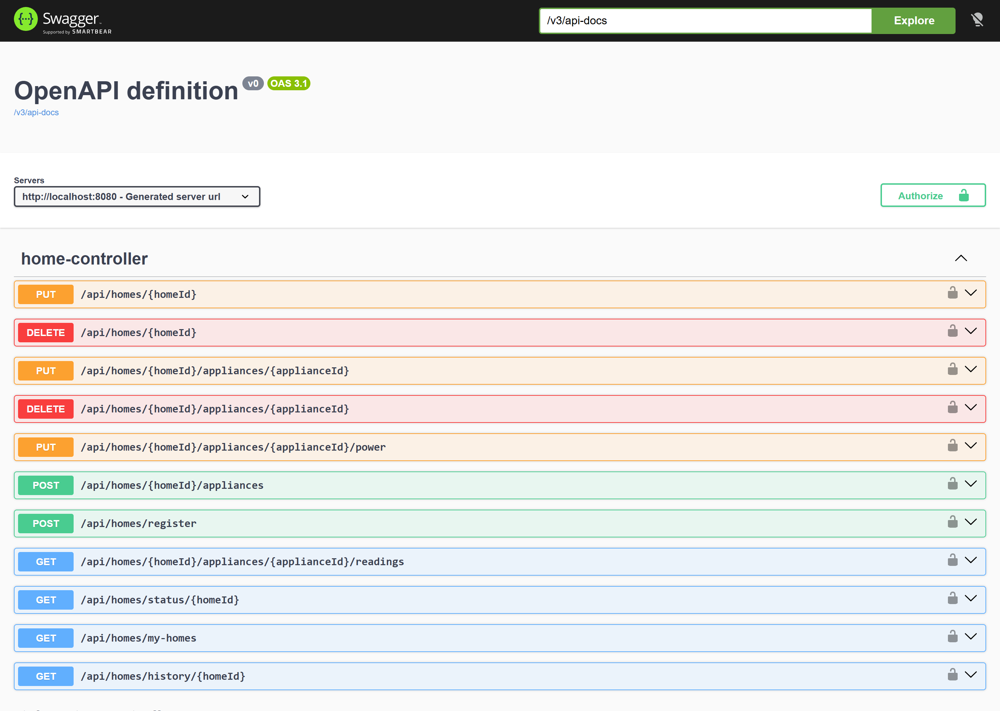

| Method | Endpoint | Source | Description |
| :--- | :--- | :--- | :--- |
| `POST` | `/api/auth/register` · `/login` | PG | Register / login (username **or** email), returns JWT |
| `POST` | `/api/homes/register` | PG + Kafka | Create home + appliances, publish `asset-registration` |
| `GET` | `/api/homes/my-homes` | PG | List the user's homes |
| `GET` | `/api/homes/status/{id}` | **Ignite** | Live metrics + per-appliance watt / anomaly |
| `GET` | `/api/homes/history/{id}` | **PG** | Daily snapshots (paged, date-filtered) |
| `GET` | `.../appliances/{id}/readings` | **Ignite** | Real per-appliance history (1h / 6h / 24h) |
| `PUT` | `.../appliances/{id}/power?on=` | PG + Ignite | Toggle appliance (off ⇒ 0 W) |
| `POST` | `/api/ai/chat` | Gemini | Ask the **Volty** assistant |
| `GET`/`POST` | `/api/eco-pet/**` | PG | Eco-Pet status / feed / rename |
| `GET` | `/api/inbox` | PG | AI advisory history |
| `POST` | `/api/telemetry/send` | Kafka | Manual telemetry injection (Swagger testing) |

---

## 🔐 Security

| Concern | Implementation |
| :--- | :--- |
| Authentication | **JWT** (HS256), 24 h expiry |
| Passwords | **BCrypt** hashing (never plaintext) |
| Sessions | **Stateless** |
| Ownership | `assertOwnership` → 403 (users only access their own homes) |
| Secrets | `${VAR:default}` — read from env, `application-local.properties` git-ignored |

> [!NOTE]
> **No secret is hardcoded.** The Gemini key, mail credentials, and JWT secret are all injected at runtime. The app boots with safe local defaults and degrades gracefully when they are absent (AI fallback text, email skipped).

**Provide secrets locally** via a git-ignored file:

```bash
cd voltify-core/src/main/resources/
cp application-local.properties.example application-local.properties
# then fill in GEMINI_API_KEY, MAIL_USERNAME, MAIL_PASSWORD, JWT_SECRET
```

---

## 🧰 Tech Stack &amp; Design Rationale

| Layer | Technology |
| :--- | :--- |
| **Backend** | Java 17 · Spring Boot (Web, Data JPA, Security, Kafka, Mail) · Maven |
| **Data &amp; messaging** | PostgreSQL 15 · Apache Ignite 2.15 · Apache Kafka 7.4 + Zookeeper |
| **Frontend** | React 19 · React Router 6 · Recharts · Three.js / R3F · Framer Motion · Axios |
| **AI, docs &amp; infra** | Google Gemini · OpenAPI / Swagger · Docker Compose |

| Decision | Rationale |
| :--- | :--- |
| Write Ignite **before** PostgreSQL | Live reads must be sub-millisecond and never blocked by DB latency |
| Ignite (not Redis) as the fast tier | Native Java object caching &amp; indexed types fit the Spring/Kafka stack with no extra glue |
| **Instantaneous** watts for the power quota | Cumulative watts would trip the limit within seconds; instantaneous draw reflects true overload |
| One-time breach flags | Alert exactly once per threshold crossing — no duplicate emails |
| Kafka between simulator &amp; engine | Loose coupling: neither side can stall the other |
| Resilient AI/email chain | Missing key → fallback text; missing mail creds → skip. The app never crashes or blocks a thread |

---

## 📁 Project Structure

```
i2i-Academy-Voltify-18/
├── docker-compose.yml          # PostgreSQL + Kafka + Zookeeper + Ignite
├── README.md
├── docs/images/                # screenshots used in this README
├── voltify-core/               # Spring Boot backend
│   └── src/main/
│       ├── java/com/voltify/core/
│       │   ├── config/         # Ignite, Security, OpenAPI
│       │   ├── controller/     # Auth, Home, Ai, EcoPet, Inbox
│       │   ├── dto/ · entity/ · repository/ · security/
│       │   ├── service/        # TariffEngine, Home, Gemini, Email, schedulers…
│       │   └── telemetry/      # Simulator + Kafka consumer
│       └── resources/
│           ├── application.properties
│           └── schema.sql      # DDL (auto-run by Docker)
└── voltify-web/                # React frontend
    └── src/
        ├── components/         # Slideovers, modals, VoltBot widget
        ├── pages/              # Dashboard, HomeDetail, Devices, Billing, MetaHome (3D)…
        └── services/           # Axios API layer (JWT + toast interceptors)
```

---

## 👥 Team

Designed and built for the **i2i Academy Program** by the **Voltify Team**:

**Hilal Ayşe Akgül** · **Sude Naz Aktaş** · **Volkan Yüksel**

<div align="center">

[](http://34.179.235.4)

</div>
